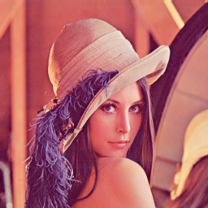
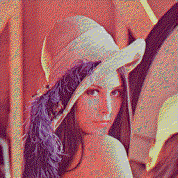
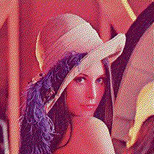
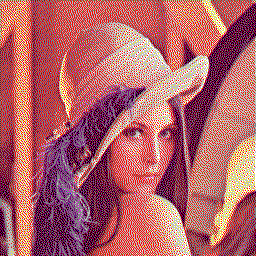

# hquant

High quality quantization for [Pillow](https://python-pillow.org/) images.

Pillow uses Euclidean distance for color matching during quantization, which yields poor results
when using RGB due to the nonlinearity of color perception. YCbCr is a better fit for Euclidean
distance, but Pillow does not natively support quantization of such images.

This module improves the quantization by converting the images to YCbCr, and then tricking
Pillow into thinking it's an RGB image so quantization works.

## Samples

The following samples dither the original image to the classic 16 colors supported in all terminals,
using RGB (as Pillow quantize method would normally use), CIELAB and YCbCr.

| Original                                    | RGB                                         | CIELAB                                         | YCbCr                                           |
| ------------------------------------------- | ------------------------------------------- | ---------------------------------------------- | ----------------------------------------------- |
|      |      |      |      |
|  |  |  |  |
